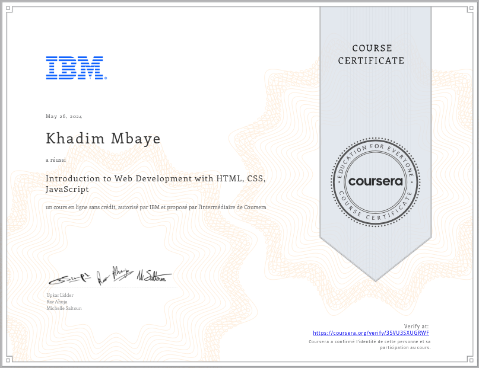

## Coursera Certification:
  

<h1 align="center">Screen Shot</h1>
<h1 align="center">🌟 Final JavaScript Project - IBM Coursera 🌟</h1>

## 🖥️ Visual Studio Code

  

## 📝 First Page

  

## 🧑‍💻 About Us Section

  

## 📞 Contact Us Section

  

## 🌍 Countries Search

  

## 🏖️ Beaches Search

  

## 🏛️ Temples Search

      

<h2 align="center">🔗 <a href="https://khadimmbaye0.github.io/FINAL_JS_PROJECT_COURSERA_IBM_FORMATION/">Link to the Website</a> 🔗</h2>

---
Nb: no responsive on this page 😭
